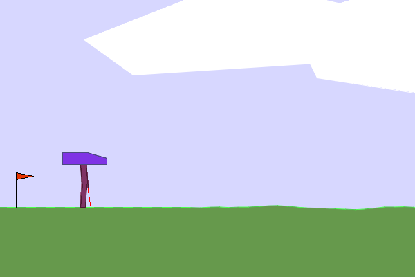
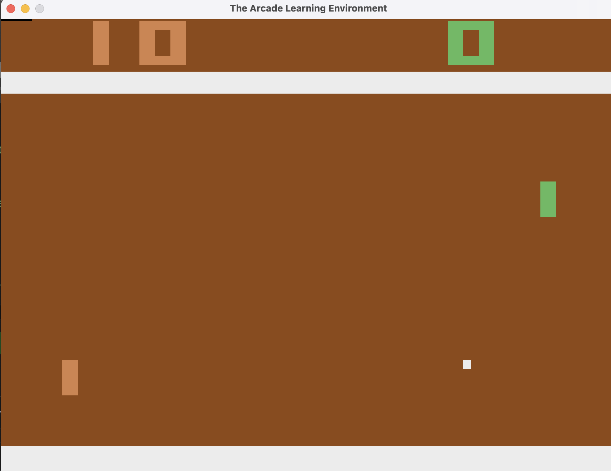
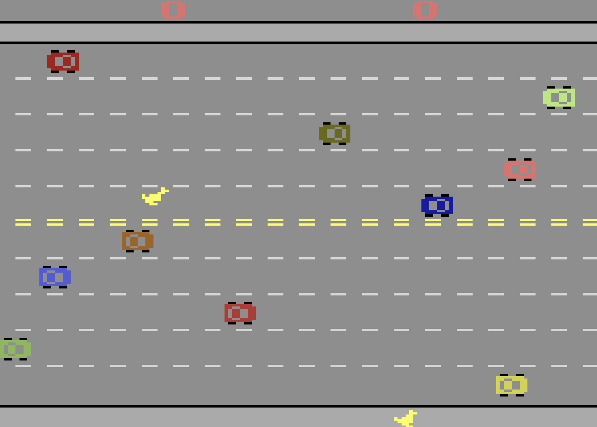
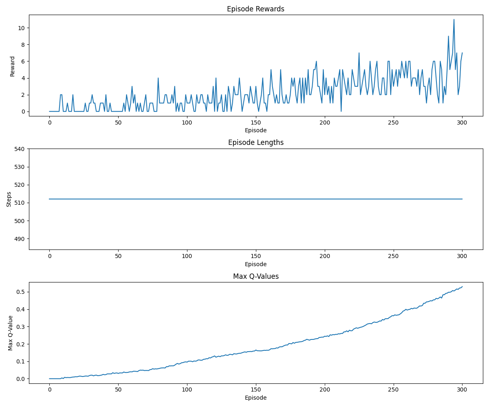

# Joe Reger's Reinforcement Learning Experiments with Gymnasium

This personal repository contains a collection of experiments and solutions for various reinforcement learning problems using the [Gymnasium](https://gymnasium.farama.org/) library by the Farama Foundation. The primary goal is personal learning and exploration of different RL algorithms and techniques.  Just playing around.

## Recent Results

### Bipedal Walker Experiments



For the challenging Bipedal Walker environment, multiple approaches have been implemented to explore different reinforcement learning techniques:

**1. PPO (Proximal Policy Optimization)** - `bipedal_walker.py`
- A policy gradient method that alternates between sampling data through interaction with the environment and optimizing a surrogate objective function
- Features actor-critic architecture with separate networks for policy and value functions
- Implements visualization of neural network activations for better understanding of the agent's decision-making

**2. A3C (Asynchronous Advantage Actor-Critic)** - `bipedal_walker-a3c.py`
- Leverages parallel actors to gather diverse experiences and stabilize training
- Uses a shared network with both policy (actor) and value (critic) outputs
- Includes a grid search implementation to optimize hyperparameters including learning rate, discount factor, and optimizer selection

**3. Genetic Algorithm** - `bipedal_walker_plus_genetic_algorithm.py`
- Evolutionary approach that maintains a population of potential solutions
- Uses selection, crossover, and mutation to evolve network weights without traditional backpropagation
- Provides an interesting contrast to gradient-based methods for complex control problems

These diverse approaches demonstrate the trade-offs between different reinforcement learning paradigms when applied to challenging continuous control problems. More detailed information about each approach can be found in the environment's Memory Bank documentation.

### Pong with DQN



A Deep Q-Network (DQN) agent has been implemented for the classic Atari game Pong (`PongNoFrameskip-v4`). This implementation follows common best practices ("Smart Defaults") for Atari DQN agents, including:

- **Preprocessing:** Grayscale conversion, downsampling to 84x84, and stacking 4 consecutive frames to provide motion context.
- **CNN Architecture:** A standard 3-layer convolutional neural network followed by fully connected layers, as described in DeepMind's 2015 Atari paper.
- **Replay Buffer:** Stores experiences for decorrelated training.
- **Target Network:** Used to stabilize Q-value learning.
- **Epsilon-Greedy Exploration:** Balances exploration of new actions with exploitation of known good actions.

The script `pong/pong_dqn.py` includes options for training, evaluation, human-readable rendering, and loading checkpoints. Training progress (rewards, Q-values) will be plotted and saved to the `data/pong/` directory.

### Freeway with Double DQN



After implementing the Double DQN algorithm for the Atari Freeway environment with frame skipping and MPS acceleration on Apple Silicon, the agent was trained overnight with impressive results:



**Training Summary:**
- **Initial Performance**: The agent started with scores of 0-2 points, mostly choosing random actions
- **Middle Training**: By episodes 150-200, consistent improvement with scores averaging 2-4 points
- **Final Performance**: Episodes 280-310 show significant learning with scores consistently reaching 4-6 points and occasional peaks of 8-10 points
- **Max Q-Values**: Steady increase from near 0 to 0.5+, indicating the agent is developing accurate value estimates
- **Notable Achievements**: The agent achieved a high score of 10+ in later episodes, showing it learned to navigate traffic effectively

The upward trend in rewards and steadily increasing Q-values demonstrate the effectiveness of the Double DQN architecture with frame skipping over standard DQN for this environment.

## Project Structure

The project is organized with a dedicated folder for each Gymnasium environment being tackled. Each environment's folder aims to be self-contained, including all solution scripts and necessary utility files.

-   `bipedal_walker/`: Solutions for the Bipedal Walker environment.
-   `pong/`: Solutions for the Pong environment.
-   `freeway/`: Solutions for the Freeway environment.
-   `cart_pole/`: Solutions for the Cart Pole environment.
-   `lunar_lander/`: Solutions for the Lunar Lander environment.
-   `mountain_car/`: Solutions for the Mountain Car environment.
-   `memory-bank/`: Contains detailed documentation for Cline (AI assistant) to maintain context about the project, including specifics for each environment.
-   `data/`: Contains saved models, logs, or experiment results for each environment in a corresponding sub-directory (e.g. `data/pong/`).
-   `GymnasiumVENV/`: Python virtual environment for the project.

## Approaches Applied (Summary)

Detailed information about the specific algorithms, hyperparameters, and results for each approach can be found in the `approaches.md` file within each environment's Memory Bank directory (e.g., `memory-bank/environments/bipedal_walker/approaches.md`).

Here's a high-level overview of environments and the corresponding solution files:

*   **Bipedal Walker:**
    *   `bipedal_walker/bipedal_walker_plus_genetic_algorithm.py`
    *   `bipedal_walker/bipedal_walker-a3c.py`
    *   `bipedal_walker/bipedal_walker.py`
*   **Pong:**
    *   `pong/pong_dqn.py`
*   **Freeway:**
    *   `freeway/freeway_double_dqn.py`
*   **Cart Pole:**
    *   `cart_pole/cart_pole.py`
*   **Lunar Lander:**
    *   `lunar_lander/lunar_lander.py` (currently a basic random agent script)
*   **Mountain Car:**
    *   `mountain_car/mountain_car_discrete.py` (currently a basic random agent script)

## Installation

1.  **Clone the repository:**
    ```bash
    git clone <repository-url>
    cd <repository-name>
    ```

2.  **Set up Python Virtual Environment:**
    It's recommended to use the provided `GymnasiumVENV/` or create your own.
    To activate the existing venv (on macOS/Linux):
    ```bash
    source GymnasiumVENV/bin/activate
    ```
    If creating a new one:
    ```bash
    python3 -m venv MyVenv
    source MyVenv/bin/activate
    ```

3.  **Install Dependencies:**
    A `requirements.txt` file will be provided. Install the necessary packages using pip:
    ```bash
    pip install -r requirements.txt
    ```
    This will install Gymnasium and other required libraries like PyTorch, TensorFlow (if used by specific agents), NumPy, and Matplotlib.

    Gymnasium itself can be installed with environment-specific extras if needed, e.g., `pip install "gymnasium[box2d]"`. Refer to the [Gymnasium documentation](https://gymnasium.farama.org/environments/box2d/) for details on specific environment dependencies.

## How to Run Experiments

Each environment's solution script can typically be run directly from its respective folder or from any location.

For example, to run a Bipedal Walker experiment:
```bash
cd bipedal_walker
python bipedal_walker.py
```

Or to run the Cart Pole experiment:
```bash
cd cart_pole
python cart_pole.py
```

All scripts implement absolute path resolution, ensuring that data files are always saved in the correct `/data/<environment_name>/` directory, regardless of where the script is executed from. This allows you to run scripts from any location without worrying about relative path issues.

Ensure your virtual environment is activated before running the scripts. Models, checkpoints, and visualizations will be stored in the project's main `data/` directory structure.

## Gymnasium Version

This project aims to use the Farama Foundation's `gymnasium` library. The code will be reviewed and updated to ensure compatibility with `gymnasium` (currently targeting v1.1.1 or similar recent versions). The `import gymnasium as gym` convention is used.
